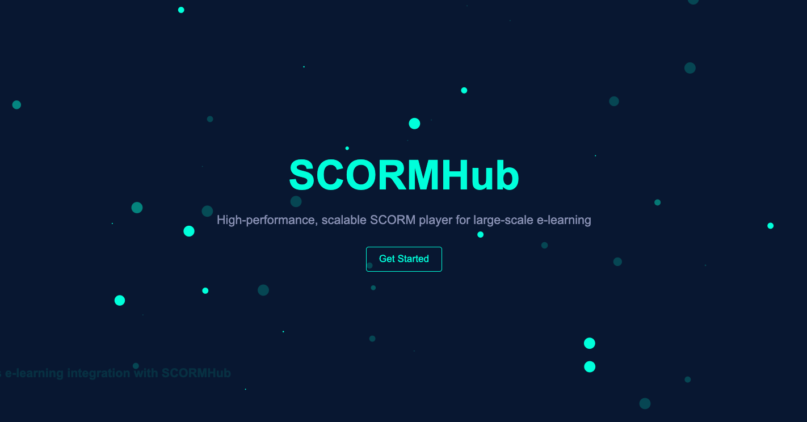

# 🚀 Optimized SCORM Player

<p align="center">
  <a href="./scorm-player.mp4">
    
  </a>
</p>

[](https://opensource.org/licenses/MIT)
[](https://www.python.org/downloads/)
[](https://www.djangoproject.com/)
[](https://docs.celeryproject.org/)

A high-performance, scalable SCORM player designed to handle large numbers of concurrent users with ease. This project optimizes SCORM interactions to reduce database load and improve overall system stability.

## 📋 Table of Contents

- [Features](#-features)
- [Why Choose This SCORM Player?](#-why-choose-this-scorm-player)
- [Technology Stack](#-technology-stack)
- [Installation](#-installation)
- [Usage](#-usage)
- [Configuration](#-configuration)
- [API Documentation](#-api-documentation)
- [Contributing](#-contributing)
- [License](#-license)

## ✨ Features

- **📊 Log-based SCORM interaction capture**: Dramatically reduces real-time database operations
- **🔄 Batch processing**: Efficiently updates the database using Celery tasks
- **🧠 Intelligent log processing**: Avoids redundant operations for completed courses
- **📁 Automated log management**: Archives processed files for improved performance
- **📈 Enhanced scalability**: Handles 10x more concurrent users compared to traditional implementations
- **🛡️ Improved data integrity**: Reduces risk of data loss during high-concurrency scenarios
- **📉 Reduced database load**: Cuts database write operations by approximately 90% during active sessions

## 🏆 Why Choose This SCORM Player?

Our optimized SCORM player stands out from traditional implementations in several key areas:

| Feature | Traditional SCORM Player | Our Optimized SCORM Player |
|---------|--------------------------|----------------------------|
| Database Load | ❌ High load due to frequent writes | ✅ Reduced load with batch processing |
| Scalability | ❌ Limited by database performance | ✅ Highly scalable with log-based approach |
| Concurrent Users | ❌ Performance degrades with more users | ✅ Efficiently handles large numbers of users |
| Data Integrity | ❌ Risk of data loss during peak loads | ✅ Enhanced data integrity with log-based system |
| Performance | ❌ Slows down under high concurrency | ✅ Maintains performance at scale |

## 🛠 Technology Stack

- **Backend**: Python 3.8+, Django 3.2+
- **Task Queue**: Celery 5.0+
- **Database**: PostgreSQL (recommended), MySQL
- **Caching**: Redis (optional, for enhanced performance)
- **Frontend**: HTML5, JavaScript (for SCORM content rendering)

## 📥 Installation

1. Clone the repository:
   ```bash
   git clone https://github.com/phostilite/django-scorm-player.git
   cd django-scorm-player
   ```

2. Set up a virtual environment:
   ```bash
   python -m venv venv
   source venv/bin/activate  # On Windows use `venv\Scripts\activate`
   ```

3. Install dependencies:
   ```bash
   pip install -r requirements.txt
   ```

4. Set up the database:
   ```bash
   python manage.py migrate
   ```

5. Create a superuser:
   ```bash
   python manage.py createsuperuser
   ```

6. Start the development server:
   ```bash
   python manage.py runserver
   ```

7. In a new terminal, start Celery:
   ```bash
   celery -A scorm_player worker -l info
   ```

## 🖥 Usage

1. Access the admin panel at `http://localhost:8000/admin` and log in with your superuser credentials.

2. Upload SCORM packages through the admin interface or using the provided API endpoints.

3. Learners can access SCORM content through your learning platform interface, which should interact with this SCORM player.

4. The system will automatically handle logging of SCORM interactions and batch processing for database updates.

## ⚙ Configuration

Key configuration options in `settings.py`:

```python
SCORM_LOGS_DIR = os.path.join(BASE_DIR, 'scorm_logs')
CELERY_BEAT_SCHEDULE = {
    'process-scorm-logs': {
        'task': 'scorm_app.tasks.process_scorm_logs',
        'schedule': crontab(minute='*/15'),  # Runs every 15 minutes
    },
}
```

Adjust the `CELERY_BEAT_SCHEDULE` to change how often log processing occurs.

## 📚 API Documentation

Our SCORM player provides a RESTful API for integration with learning platforms:

- `POST /api/scorm/upload/`: Upload a new SCORM package
- `GET /api/scorm/launch/{attempt_id}/`: Launch a SCORM attempt
- `POST /api/scorm/interact/`: Record a SCORM interaction

For detailed API documentation, please refer to our [API Guide](api_guide.md).

## 🤝 Contributing

We welcome contributions to the Optimized SCORM Player! Please read our [Contributing Guide](CONTRIBUTING.md) for details on our code of conduct and the process for submitting pull requests.

## 📄 License

This project is licensed under the MIT License - see the [LICENSE](LICENSE) file for details.

---

<p align="center">
  Made with ❤️ by Priyanshu Sharma
</p>